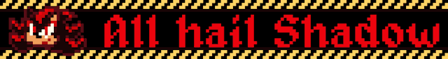
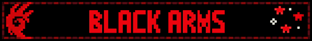

<div align="center">

# 𝐒𝐇𝐀𝐃𝐎𝐑𝐔𝐗

### `SHADOW THE HEDGEHOG // SPECIAL INTEREST // CODE ARCHIVE`


<br>






<br><br>


`SHADOW THE HEDGEHOG IS MY SPECIAL INTEREST.`

</div>

---

## 🔴 SHADOW // SYSTEM

```text
SUBJECT           SHADOW THE HEDGEHOG
SPECIAL_INTEREST  ACTIVE
ARCHIVE            SHADORUX.DEV
MODE               CATALOG / PRESERVE / BUILD
STATUS             ONLINE
```

I build and maintain an interconnected Shadow the Hedgehog web ecosystem: fan sites, archives, graphics, resources, tools, and code. The point of this profile is Shadow.

---

## 📡 SHADOW ECOSYSTEM

<div align="center">

[](https://shadorux.dev)
[](https://shadowshrine.shadorux.dev/home)
[](https://shadorux-archive.shadorux.dev/)

</div>

```text
SHADOW DATABASE // NODES
────────────────────────────────────────────────────
shadorux.dev                   MAIN SITE / WESTOPOLIS
shadowshrine.shadorux.dev      SHRINE
shadorux-archive.shadorux.dev  GRAPHICS / ARCHIVE

COLLECTION                     BLINKIES / GRAPHICS / WEB MATERIAL
RESEARCH                       FAN SITES / INTERNET HISTORY
BUILD                          SHADOW-THEMED CODE / WEB TOOLS
```

### Shadow-linked repositories

- [shadow-the-hedgehog-css](https://github.com/Shadorux/shadow-the-hedgehog-css)
- [ultimate-lifeform-translator](https://github.com/Shadorux/ultimate-lifeform-translator)
- [shadorux.dev](https://shadorux.dev)

---

## 💻 CODE // LIVE LANGUAGE DISTRIBUTION

<div align="center">


</div>

This card is calculated from the languages GitHub detects across my repositories rather than a hand-written technology list.

---

## 🛰️ GITHUB // LIVE DATA

<div align="center">


<br>


</div>

---

## 🎧 LAST.FM // LIVE TRANSMISSION

<div align="center">

<a href="https://www.last.fm/user/ultlifeform_">
  
</a>

<br>

[](https://www.last.fm/user/ultlifeform_)

</div>

---

<div align="center">

## 🔻 CHAOS CONTROL

### `WELCOME TO THE SHADORUX ZONE.`

<a href="https://youtu.be/GXioir-fujY">
  
</a>

</div>
